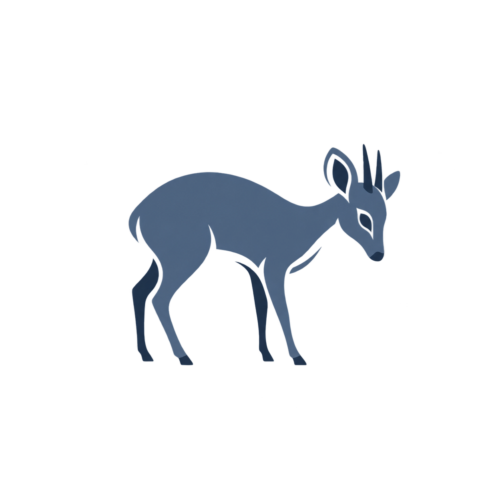

# duiker

[](https://crates.io/crates/duiker)
[](https://github.com/mrorigo/duiker/actions)
[](LICENSE-MIT)
[](https://blog.rust-lang.org/2023/05/18/Rust-1.70.0.html)
[](https://docs.rs/duiker)

<p align="center">
  
</p>

A modern, high-performance disk usage analyzer for the terminal. `duiker` provides fast, detailed, and interactive insights into your file system, helping you quickly identify large files and directories.

## 🦌 Why "duiker"?

*Duiker* (rhymes with *hiker*) is Afrikaans for **"diver"**. Meet the blue duiker: one of the world's smallest antelopes, barely 35 cm tall. When something big crashes through the undergrowth, it doesn't bolt across open ground — it dives headfirst into the thickest bush, small enough to slip through where the heavy herbivores can't follow, and noses out the fallen fruit the others left behind.

This tool does the same to your filesystem. `duiker` dives headfirst into your directory tree — every subfolder, every hidden file — and comes back with the exact spots where your disk is quietly disappearing. Small enough to live in your terminal. Fast enough that you won't wait for the answer.

(The double pun is the point: it's a disk-usage tool that starts with `du`, and "diver" turns out to be the perfect metaphor for a recursive scanner.)

## ✨ Features

-   **Blazing Fast Scans:** Built with Rust, leveraging multi-threading and inode caching for exceptional performance on large directories.
-   **Interactive TUI:** A Text User Interface (TUI) for scanning and navigating one directory tree.
    -   **Tree View:** Lists the current directory's children, sorted by size by default.
    -   **Selection Details:** Shows the selected item's full path, type, allocated size, share of the current directory, and child count.
    -   **Chart View:** Shows file-type size distribution and an overall usage summary.
    -   **Details View:** Shows the current directory as a table with name, size, and type columns.
    -   **Treemap View:** Shows a text-based size comparison of the current directory's largest children.
    -   **Navigation:** Supports directory entry, parent navigation, name filtering, and sorting by size or name.
-   **Flexible CLI:** Perform quick scans and output results in various formats directly to the console or a file.
-   **Configurable Scanning:**
    -   Follow symbolic links (`--follow-links`).
    -   Include hidden files and directories when needed (`--hidden`).
    -   Limit reported tree depth (`--max-reporting-depth`, default 3).
    -   Optionally limit filesystem traversal (`--scan-depth`); omitted by default.
    -   Adjust thread count (`--threads`).
    -   (Future: Custom ignore patterns via `.gitignore` or similar mechanism).
-   **Human-Readable Output:** Sizes are displayed in intuitive units (KB, MB, GB, etc.).
-   **JSON Export:** Programmatically access scan results for scripting and integration.

## Performance

An observed scan completed in 7.35 seconds after processing 159.3 GB, 875,319 files, and 74,395 directories.

This result is a real-world observation, not a benchmark guarantee. Scan time depends on the filesystem, storage device, directory structure, permissions, hidden-file settings, and thread count.

## 🚀 Installation

`duiker` can be installed via `cargo`, the Rust package manager.

### From Crates.io (Recommended)

```bash
cargo install duiker
```

### From Source

1.  **Clone the repository:**
    ```bash
    git clone https://github.com/your-username/duiker.git
    cd duiker
    ```
2.  **Build and install:**
    ```bash
    cargo install --path .
    ```

Ensure you have Rust and Cargo installed. If not, follow the instructions on [rustup.rs](https://rustup.rs/).

## 📖 Usage

`duiker` offers both a command-line interface (CLI) for quick output and an interactive TUI for in-depth exploration.

### Basic CLI Scan

By default, `duiker` will scan the current directory and print a tree-like output to the console.

```bash
duiker
```

To scan a specific path:

```bash
duiker /path/to/directory
```

Multiple files or directories can be scanned in one invocation:

```bash
duiker src tests README.md
```

### Interactive TUI Mode

Launch the full-featured interactive Text User Interface:

```bash
duiker interactive /path/to/directory
```

Or, to scan the current directory in interactive mode:

```bash
duiker interactive
```

**TUI Controls:**

| Key       | Action                                   |
| :-------- | :--------------------------------------- |
| `1`, `2`, `3`, `4` | Switch between Tree, Chart, Details, and Treemap views. |
| `↑`, `↓`  | Navigate up/down in lists.               |
| `Page Up`, `Page Down` | Scroll pages in lists.                 |
| `/`       | Start filtering the current directory by name; type the query. |
| `s`       | Toggle sorting by size and name.         |
| `Enter`   | Enter the selected directory, or finish filter input. |
| `Esc`     | Leave filter input mode without clearing the query. |
| `Backspace` | Go up normally, or erase one filter character while filtering. |
| `q`       | Quit the application.                    |
| `?`       | Print the key reference to the terminal. |

*(A GIF demonstrating the TUI would go here!)*

### CLI Options

Customize your scan and output using various flags:

```bash
duiker [OPTIONS] [PATH]...
```

| Short | Long            | Description                                  | Default      |
| :---- | :-------------- | :------------------------------------------- | :----------- |
| `-j`  | `--json`        | Output results in JSON format.               | `false`      |
| `-L`  | `--follow-links`| Follow symbolic links.                       | `false`      |
| `-H`  | `--hidden`      | Include hidden files and directories.        | `false`      |
| `-d`  | `--max-reporting-depth <INT>` | Maximum depth shown in human-readable tree output. | `3` |
|       | `--scan-depth <INT>` | Maximum filesystem traversal depth; truncated totals are incomplete. | Unlimited |
| `-t`  | `--threads <INT>` | Number of threads to use for scanning.       | `num_cpus`   |
|       | `--color <MODE>` | Colour output: `auto`, `always`, or `never`. | `auto`       |

**Example: Limit displayed depth, include hidden files, then output JSON**

```bash
duiker -d 3 -H --json /home/user/myproject
```

### Exporting Results

Use the `export` subcommand to save scan results to a file in a specified format.

```bash
duiker export --format <FORMAT> --output <FILE_PATH> [PATH]
```

| Argument       | Description                         |
| :------------- | :---------------------------------- |
| `--format`     | Output format: `json` or `tree`.    |
| `--output`     | Path to the output file.            |
| `[PATH]`       | Directory to scan (defaults to `.`). |

**Example: Export tree view of `/var/log` to a file**

```bash
duiker export --format tree --output var_log_tree.txt /var/log
```

**Example: Export JSON summary of `/srv/data`**

```bash
duiker export --format json --output srv_data_summary.json /srv/data
```

## 📊 Output Formats

### Tree Output (Default)

Provides a human-readable tree structure with ASCII connectors, cumulative sizes, and percentages relative to each parent.

```
Path: /path/to/directory
Used: 159.3 GiB · 875,319 files · 74,395 dirs

SIZE       %       NAME
   4.5 MiB 100%  .git/
   3.2 MiB  71%  |-- objects/
   2.8 MiB  87%  |   \-- pack/
  2.1 MiB  47%  src/
   1.2 MiB  57%  |-- main.rs
 900 KiB    43%  \-- lib.rs
```

### JSON Output (`--json` or `export --format json`)

Outputs a JSON object for one path, or an array of objects when multiple paths are scanned.
*(Note: The current JSON formatter only outputs top-level summary. Full tree export is a planned feature.)*

```json
{
  "total_size": 123456789,
  "total_files": 1234,
  "total_dirs": 56
}
```

## 🛣️ Roadmap

-   Full JSON export of the entire file tree.
-   TUI actions such as copying a selected path or opening it in the host file manager.
-   Integration with `.gitignore` for automatic ignore patterns.
-   Support for Windows (currently Unix-specific for `dev()` and `ino()`).
-   Configurable size units (binary/decimal).
-   More sophisticated Treemap visualization within the TUI.
-   Benchmarking and performance optimizations.

## 🤝 Contributing

Contributions are welcome! If you have suggestions, bug reports, or want to contribute code, please open an issue or pull request on GitHub.

1.  Fork the repository.
2.  Create your feature branch (`git checkout -b feature/AmazingFeature`).
3.  Commit your changes (`git commit -m 'Add some AmazingFeature'`).
4.  Push to the branch (`git push origin feature/AmazingFeature`).
5.  Open a Pull Request.

Please ensure your code adheres to Rust's best practices and includes tests where appropriate.

## 📝 License

`duiker` is distributed under the [MIT License](LICENSE-MIT) or [Apache-2.0](LICENSE-APACHE), at your option.

---

Made with ❤️ by @mrorigo and DeepSeek V3.2
